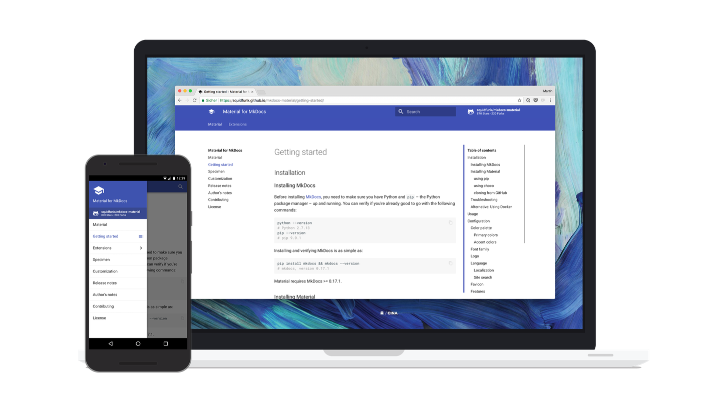

# MkdocsをDockerで動かしてみた
## はじめに
MkdocsをDockerで利用する方法です。  
普通にMkdocsを導入する際に必要なmkdocs本体、デザインのインストールが不要になります。

## Mkdocsとは
Markdown形式のファイルをドキュメントサイトの形に変換してくれる高速でシンプルな静的サイトジェネレーターです。  
いくつかデザインが用意されていますが、[material](https://squidfunk.github.io/mkdocs-material/) デザインがメジャーなようです。



Mkdocsでは、以下の構成のプロジェクトフォルダが必要になります。

```text
documentフォルダ
|-- docs    # markdownファイルや画像を格納するフォルダ
|   |-- 各ページのmarkdownファイル
|   `-- img
|        `-- 画像ファイル
|
|-- mkdocs.yml　# mkdocsの設定ファイル
`-- site        # mkdocsで生成されたファイルが格納されるフォルダ
```

`mkdocs.yml` に各種設定を記載します。  
以下は例になるので、設定値は適宜変更してください。

```yaml
site_name: サイト名

# ページとmarkdownファイルを紐づける設定
nav:
  - 概要: index.md
  - page1: page1.md
  - page2: page2.md

# ページのデザイン設定
theme:
  name: 'material'
  language: 'ja'
  palette:
    primary: 'indigo'
    accent: 'indigo'
  font:
    text: 'Roboto'
    code: 'Roboto Mono'

# 検索機能の設定
extra:
  search:
    language: 'jp'

# 拡張機能の設定
markdown_extensions:
  - admonition
  - footnotes
  - codehilite
  - toc:
      permalink: true
  - pymdownx.tasklist:
      custom_checkbox: true

```

## Dockerでの実行手順
DockerHubに [mkdocs](https://hub.docker.com/r/squidfunk/mkdocs-material/) イメージが公開されているので、これを利用します。

```shell
docker pull squidfunk/mkdocs-material
```

### サイトプレビュー
プロジェクトフォルダ内の `mkdocs.yml` ファイルと同じディレクトリにいることを確認してから、Dockerコマンドを実行します。

```shell
docker run --rm -it -p 8000:8000 -v ${PWD}:/docs squidfunk/mkdocs-material
```

上記のコマンドでは、ローカル上のMarkdownファイルが格納されているdocsフォルダをコンテナにマウントしています。

コンテナが起動すると、ファイル変更を監視している状態となります。  
変更が発生するとリロードする必要なく、リアルタイムで反映されます。

[http://localhost:8000](http://localhost:8000) にアクセスし、正常にWebサイトが表示されることを確認します。

コンテナを終了する場合は、`Ctrl` + `c`  
（ `--rm` オプションをつけて起動しているため、終了時にコンテナは削除されます）

### ビルド
プレビューでの確認が完了したら、以下コマンドでビルドを行い、markdownファイルをもとに静的コンテンツを生成します。

```shell
docker run --rm -it -v ${PWD}:/docs squidfunk/mkdocs-material build
```

ビルドが完了すると、siteフォルダに変換されたファイル群が生成されます。

後は、siteフォルダに生成されたファイルをGitHub Pagesや、S3などにデプロイすればWeb公開できます。